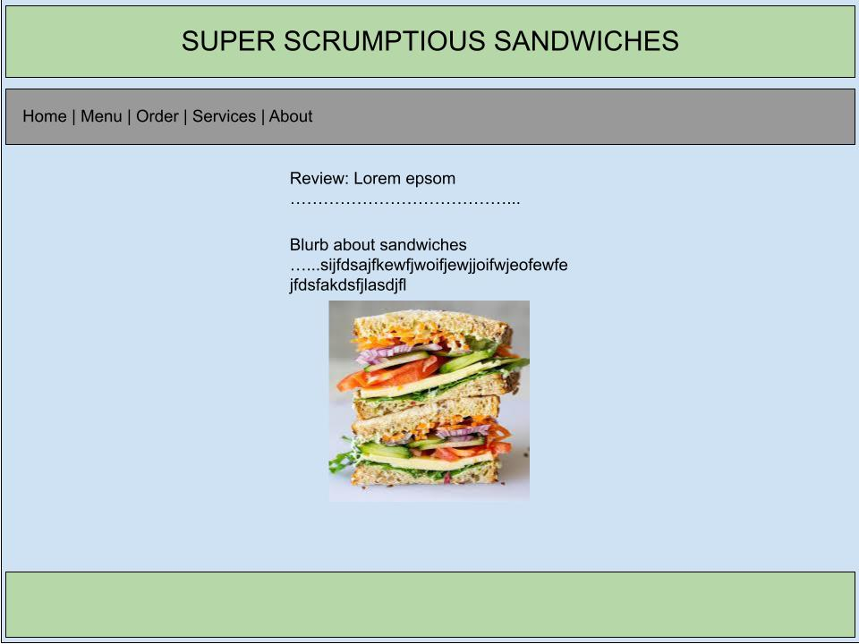

# BusinessWebsite
Fake business website created for CS20.

## Project Requirements

(From spec sheet)

- You must have at least 5 pages including a home page, a contact page, and a services page.
TODO: Finish pages
- Content must be "real" and realistic. Lorum Ipsum text is not acceptable.  
- You must have at least 15 css style rules
- Include an external stylesheet and an internal stylesheet
- Include at least one image and one background image. 
TODO: Include background image
- You must include at least three fixed elements to make the site look consistent - for example: header, navigation and footer 
- The site must be responsive and pass a mobile friendly test: https://search.google.com/test/mobile-friendly 
TODO: Double check when submitting
- You may choose github hosting or cpanel hosting
- Images must NOT have any watermarks on them

## Design

- Name of business: Super Scrumptious Sandwiches
- What business does: Makes sandwiches
- Target demographic: Anyone who is hungry, sandwich enthusiasts.
- How the website helps the business: 
    - Spreads awareness about the restaraunt
    - Gives people informaton about the restaraunt such as location, menu, and phone number
    - Allows people to order food online
    - Creates a positive image for the business
- Sketch: 

## Questions

- What was the easiest part of this assignment?
- What was the most challenging part of this assignment?

## Rubric
- Site runs online and meets requirements - 50 points
- Design document – 10 points
- Questions answered – 5 points
- Quality of HTML/CSS code - 20 points
- Creativity/effort – 20 points

## Acknowledgements

- Navigation bar is from https://www.w3schools.com/css/css_navbar.asp

## Page Contributors
Jimmy Maslen and Theseus Lim
